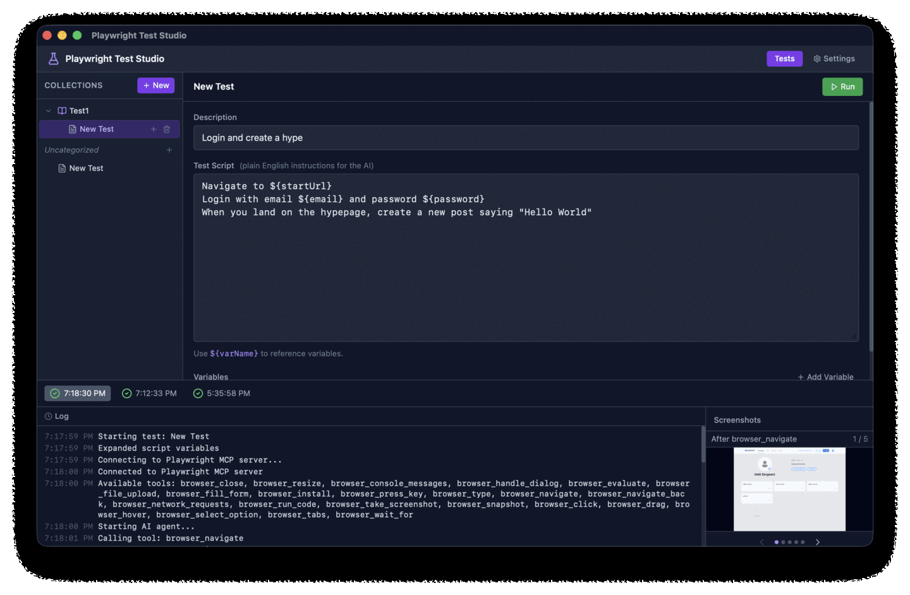

# Playwright Test Studio

A desktop application for QA engineers: write plain-English test scripts and run them via an AI agent that controls a real browser using [Playwright MCP](https://github.com/microsoft/playwright-mcp).

<p align="center">
  
</p>

## Features

- 📝 Write tests in plain English — no code required
- 🤖 AI-powered execution via OpenAI, Anthropic, Groq, Azure OpenAI, or xAI
- 🌳 Hierarchical test collections — child tests continue from where the parent left off
- 🔑 Variable expansion (`${varName}`) for reusable scripts
- 📸 Automatic screenshot capture during test runs
- 📊 Run history with pass/fail tracking over time
- 🌐 HTTP failure logging
- ⚙️ GUI-based setup and configuration

## Quick Start

### Prerequisites

- An API key for your preferred AI provider (OpenAI, Anthropic, Groq, Azure OpenAI, or xAI)

### Running from source

Prerequisites: [Node.js 18+](https://nodejs.org/)

```bash
# Install dependencies
npm install

# Start development server
npm run dev
```

### Building for production

```bash
npm run build
```

### Running tests

```bash
npm test
```

## Documentation

See [docs/README.md](docs/README.md) for full documentation including:

- Writing test scripts
- Variable usage
- Test hierarchy
- Supported AI providers
- Screenshot browsing
- Run history

## Development

This application is built with [Tauri](https://tauri.app/) (Rust backend + web frontend).

```bash
# Type checking
npm run type-check

# Lint
npm run lint

# Watch mode tests
npm run test:watch

# Check Rust code compiles
npm run cargo-check

# Build the runner
npm run bundle-runner
```

## CI / Builds

- **CI**: automatically runs on push/PR — type-checks and tests
- **Build**: manually triggered via GitHub Actions for macOS (.dmg), Windows (.exe), and Linux (.AppImage/.deb)

See `.github/workflows/` for workflow definitions.
